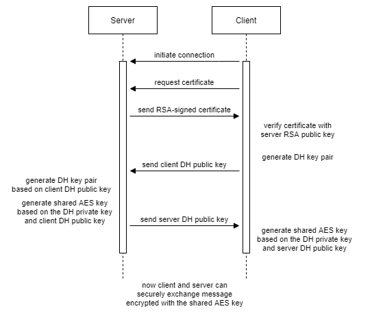
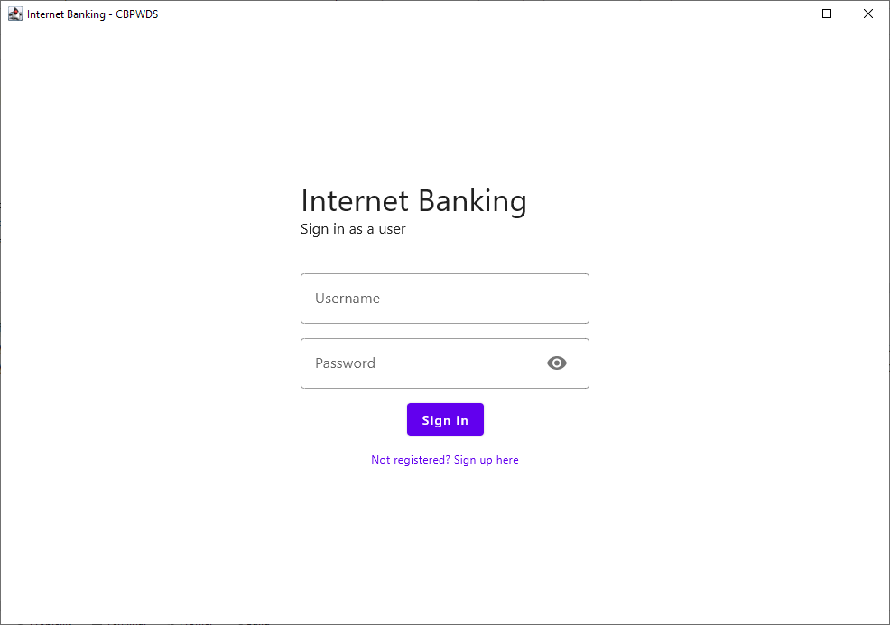
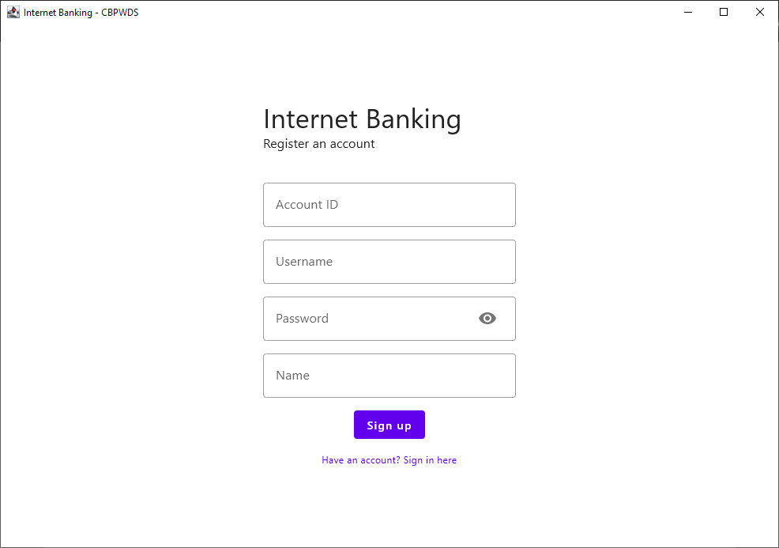
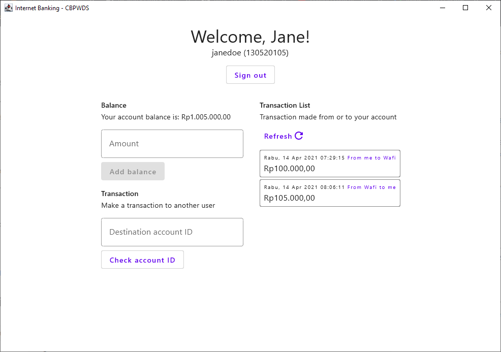

Aplikasi internet banking sederhana yang mendemonstrasikan beberapa teknik kriptografi untuk mata kuliah Information Security and Assurance (1604B045) Teknik Infromatika Universitas Surabaya

**_Aplikasi ini berusaha untuk menirukan protokol [Transport Layer Security (TLS)](https://en.wikipedia.org/wiki/Transport_Layer_Security) secara naif sehingga tidak tepat untuk digunakan pada lingkungan produksi_**

#### Anggota kelompok

- Christopher Angelo Lomban (160419058)
- Herliansyah Bagus Priambodo (160419082)
- Pandu Sanika Satya Wada Nurrahman (160419096)
- Wafi Azmi Hartono (160419098)
- David Pratama (160419103)
- Starif Pahlaurelf Girsang (160419149)

#### Teknik kriptografi

- [Rivest–Shamir–Adleman (RSA)](https://en.wikipedia.org/wiki/RSA_(cryptosystem))

  Digunakan untuk memeriksa keaslian server (menggunakan tanda tangan digital)

- [Diffie-Hellman key exchange](https://en.wikipedia.org/wiki/Diffie%E2%80%93Hellman_key_exchange)

  Digunakan untuk melakukan pertukaran kunci enkripsi komunikasi antara client dengan server

- [Advanced Encryption Standard (AES)](https://en.wikipedia.org/wiki/Advanced_Encryption_Standard)

  Digunakan untuk mengenkripsi komunikasi antara client dengan server (menggunakan kunci hasil teknik Diffie-Hellman key exchange)

- [Secure Hash Algorithms (SHA)](https://en.wikipedia.org/wiki/Secure_Hash_Algorithms)

  Digunakan untuk menyimpan password user

#### Diagram alur kriptografi

#### Menjalankan aplikasi

> Java Development Kit (JDK) 11 diperlukan untuk menjalankan aplikasi. JDK dapat diunduh [di sini](https://adoptopenjdk.net/)

Jalankan command berikut pada root project: `./gradlew run`

#### Screenshots

